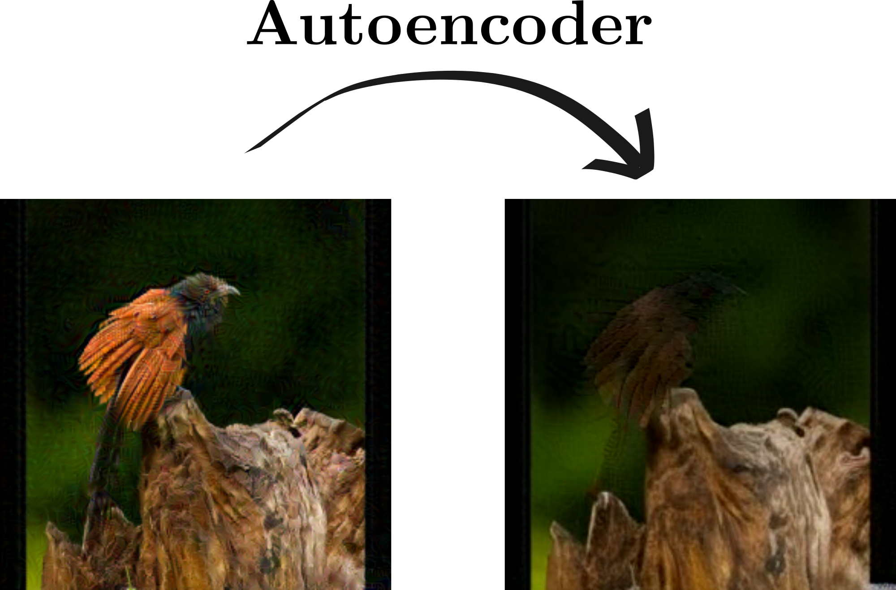

# Master's Semester project

Title: **Adversarial Attacks on Autoencoders**

This projects contains two parts:
- [a report](./tex/out/main.pdf),
  highlighting the main experiments and results of the project;
- [a python codebase](./code) containing the code used to make the experiments.
Of particular interest should be the [figures notebook](./code/figures.ipynb),
which contains the code used to generate all the figures of the report.

